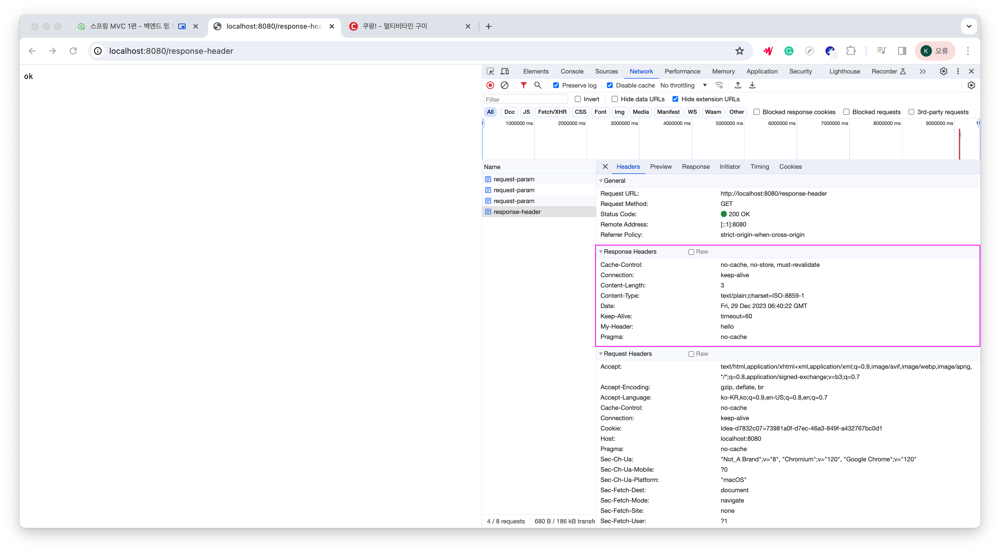

# HttpServletResponse - 기본 사용법

- HTTP 응답 메시지 RESPONSE의 역할
- 응답 메시지를 생성한다.
- 개발자가 직접 응답 메시지를 적는 번거로움을 줄이기 위한 메서드를 제공한다.
- 대표적으로 HTTP 응답코드를 지정할 수 있다. (200,404,500 등)
- 헤더 값과 바디 값을 생성할 수 있다.
- 편의 기능 제공한다: Content Type, 쿠키, Redirect

1. Response 디렉토리 생성
2. [ResponseHeaderServlet](../src/main/java/hello/servlet/basic/response/ResponseHeaderServlet.java) 클래스 생성
````java
package hello.servlet.basic.response;

import jakarta.servlet.ServletException;
import jakarta.servlet.annotation.WebServlet;
import jakarta.servlet.http.HttpServlet;
import jakarta.servlet.http.HttpServletRequest;
import jakarta.servlet.http.HttpServletResponse;

import java.io.IOException;
import java.io.PrintWriter;

@WebServlet(name = "responseHeaderServlet", urlPatterns = "/response-header")
public class ResponseHeaderServlet extends HttpServlet {
    @Override
    protected void service(HttpServletRequest request, HttpServletResponse response) throws ServletException, IOException {
        //[status-line]
        response.setStatus(HttpServletResponse.SC_OK);

        //[response-headers]
        response.setHeader("Content-Type", "text/plain");
        response.setHeader("Cache-Control", "no-cache, no-store, must-revalidate");
        response.setHeader("Pragma", "no-cache");
        response.setHeader("my-header", "hello"); //임의의 헤더

        PrintWriter writer = response.getWriter();
        writer.println("ok");

    }
}
````

3. 실행결과 위에 response.setXXX 으로 설정해두었던 헤더들이 잘 들어가있는 것을 알 수 있다.
4. 


