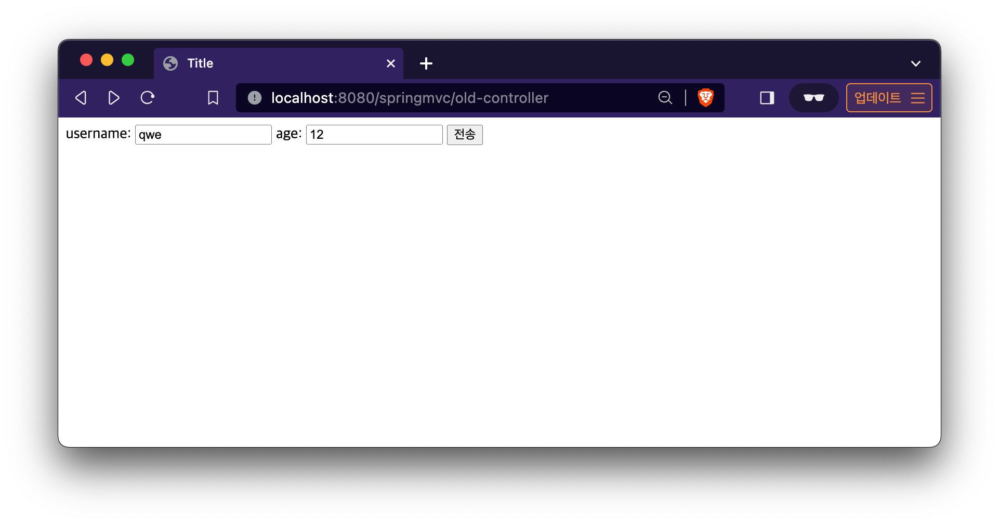

# [뷰 리졸버](Lecture-Note/5-3.md)

[OldController 클래스](../src/main/java/hello/servlet/web/springmvc/old/OldController.java)
```java
@Component("/springmvc/old-controller")
public class OldController implements Controller {
    @Override
    public ModelAndView handleRequest(HttpServletRequest request, HttpServletResponse response) throws Exception {
        System.out.println("OldController.handleRequest");
        return new ModelAndView("new-form");
    }
}
```
콘솔에는 OldController.handleRequest 가 출력된다.    
그러나 jsp 파일인 new-form 을 반환하도록 하였지만, view 가 없어서 반환하지를 못한다.  
view resolver 를 만들어주어야 한다.       

[application.properties](../src/main/resources/application.properties)
```spring.mvc.view.prefix=/WEB-INF/views/```
```spring.mvc.view.suffix=.jsp```



view-resolver 정상 작동.


---
[목차](../README.md)